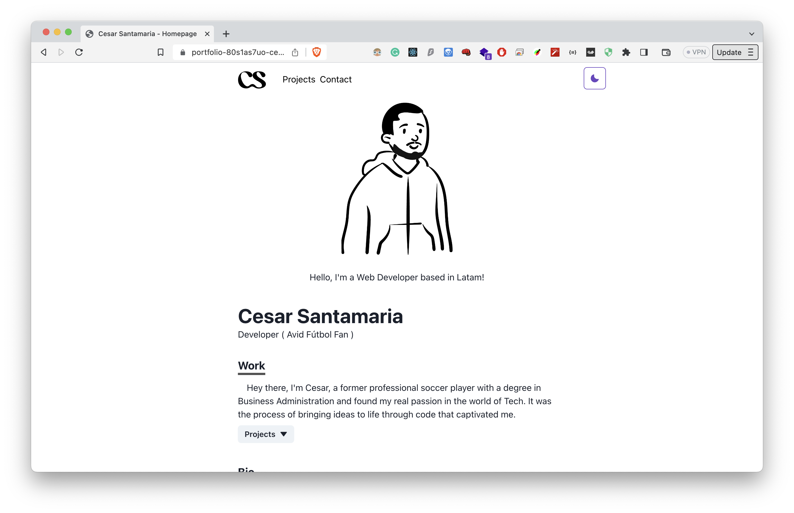

# Portfolio Site
Portfolio site to showcase recent projects I have built.

**Link to project:** https://vercel.com/cesar-santamaria/portfolio

## How It's Made:

**Tech used:** React NextJS

## Dependencies
React
Next
Framer-motion
chakra-ui

## Getting Started
Install dependencies using the npm install command within each folder directory.

- Start the web server using the npm run dev. The site will be served on http://localhost:3000/.

